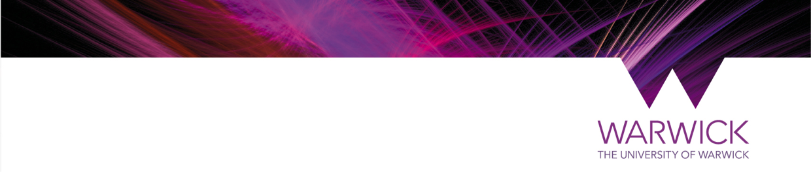

+++
categories = ""
comments = false
date = "2018-01-25"
draft = false
slug = ""
tags = ""
title = "Consent for Warwick studies"
description = "Landing page for Warwick studies"
showpagemeta = false
+++
    

--UNDER CONSTRUCTION--

**The influence of phonological, orthographic, and semantic similarity structure of memory on language processing and learning**

Lead researcher: Cynthia S. Q. Siew, PhD 
  
***

At this point, you should have read the Participant Information Sheet.  
  
If you have any questions about this project, please don't hesitate to contact Cynthia Siew (C.Siew@warwick.ac.uk).
  
Click on the link below to proceed to the online consent form:
  
* [Proceed to online consent form](http://qualtrics/csqsiew)
  
Thank you for your participation. 

